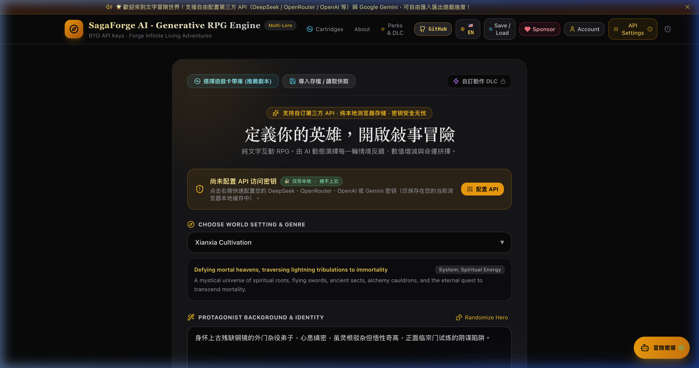
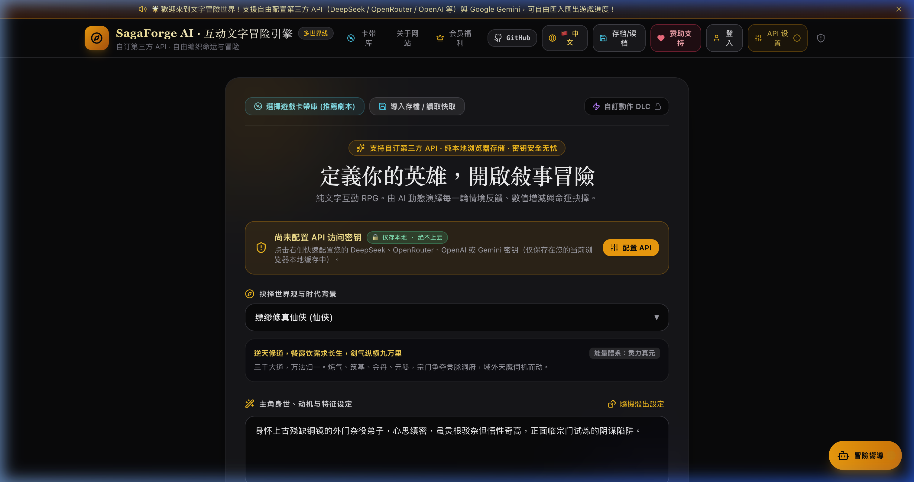
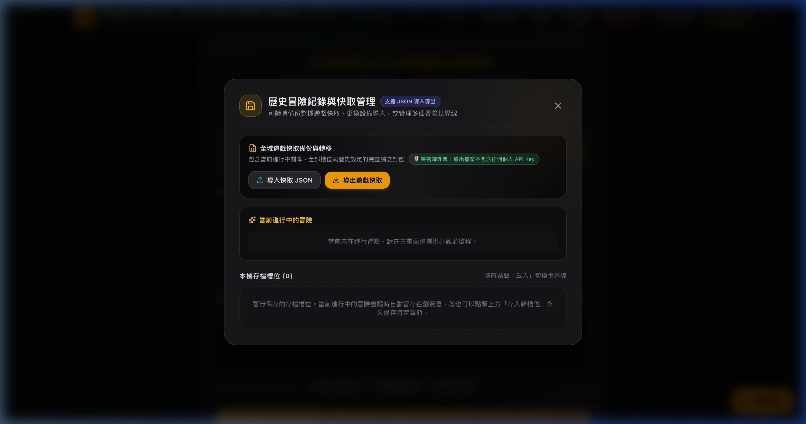

# 🌌 SagaForge AI

<div align="center">

<p align="center">
  <strong>The Generative AI RPG & Living Text Adventure Engine</strong><br/>
  <em>Bring Your Own API Keys · Real-Time Scene Diffusion · Interactive Mini-Games · Zero-Cloud-Key Privacy</em>
</p>

[](LICENSE)
[](https://github.com/8tis/SagaForge-AI)
[](https://github.com/8tis/SagaForge-AI)
[](https://react.dev/)
[](https://vitejs.dev/)
[](https://www.typescriptlang.org/)
[](https://expressjs.com/)
[](#-internationalization--bilingual-support)

[**English**](README.md) | [**简体中文**](README_CN.md) | [**GitHub Repository**](https://github.com/8tis/SagaForge-AI)

</div>

---

## 📖 Overview

**SagaForge AI** is an open-source, next-generation generative text adventure game engine and AI Game Master (GM) platform. Inspired by visual gamebooks and survival titles like *Cyberhiking*, SagaForge transforms large language models into a living, responsive universe.

Unlike traditional text adventures that stretch endlessly into unreadable logs, SagaForge AI introduces a sleek **E-Book Style Focus Pagination system**, atmospheric **AI scene image diffusion**, procedurally generated **in-game puzzle mechanisms**, and **military-grade client-side API key encryption**.

---

## 📸 Screenshots Showcase

| English Interface & World Setup | 简体中文界面与世界观设定 |
|:---:|:---:|
|  |  |
| *Bilingual Support, Archetype Randomizer & Top Navigation* | *中英无缝切换、预设世界观与角色卡构建* |

<div align="center">

### 💾 Cartridge Archive & Save/Load Manager

*Cloudless local game saves, portable JSON story cartridges, and novella distillation*

</div>

---

## ✨ Key Features

### 1. 📖 Focus Page-by-Page Reading (Inspired by *Cyberhiking*)
- **E-Book Focus Mode (Default)**: Displays one chapter/act at a time, keeping your screen clean and immersive without endless scrolling fatigue.
- **Act Navigation Stepper**: Effortlessly flip through past chapters with `[◀ Prev Act]` `Act X / Y` `[Next Act ▶]`.
- **Quick Return Pulse**: Review past lore at any time; jump back to the active scene with one click `[Latest ⚡]`.
- **Full Keyboard Shortcut Support**:
  - `←` / `→` arrow keys: Flip back and forth between story acts.
  - `1`, `2`, `3`, `4` number keys: Instantly execute tactical decisions.
- **Dual Mode Switcher**: Toggle between **Focus View** and **Collapsible Timeline View** at any time.

### 2. 🎨 Living Visual Scene Diffusion
- **Ultra-Contextual Scene Illustrations**: Real-time scene art rendered in harmony with the current narrative, environment, and weather.
- **Multi-Model Support**: Powered by Pollinations, Flux, SDXL, and OpenAI DALL-E with customizable artistic styles.
- **Scene Lightbox & Redraw**: Inspect full-resolution illustrations, inspect visual prompt tokens, and re-roll scene art on demand.

### 3. 🎲 Emergent Mini-Games & Destiny Checks
- **Spontaneous Peril Mechanisms**: Not every turn is a puzzle—mini-games emerge organically as surprises during exploration (ruins, vault locks, trapped chests, disrupted mana circuits).
- **Zero-Hardcoding / AI Dynamic Generation**:
  - 🔢 **Password Locks**: Dynamic 4-digit codes with clues woven directly into dialogue, historical steles, and narrative poetry.
  - ⚖️ **Algebraic Seals**: Procedural linear equations ($Ax \pm B = C$) manifested as mystical balancing scales or stone tablet inscriptions.
  - ⚡ **Mana / Wire Circuit Defusal**: Multi-colored tactical conduit puzzles governed by elemental affinities or defusal manuals.
  - 🎯 **Lockpick QTE**: Reflex-based timing bar challenge to intercept mechanical weak points.
- **Destiny D20 Rolls**: Roll an interactive 20-sided fate die during AI generation pauses to test your fortune (Critical Success, Fumbles, and Guidance).

### 4. 🛡️ 100% Client-Side Private Key Encryption
- **Zero Cloud Key Storage**: Your OpenAI, Gemini, DeepSeek, or OpenRouter keys are **never stored on any server database**.
- **Salted Local Ciphering**: Keys are encrypted with salted ciphers and stored **exclusively in your local browser storage**.
- **Payload Sanitization**: Server-side proxies decrypt keys on-the-fly inside memory solely for outbound LLM calls, keeping your credentials leak-proof.

### 5. 🌐 Full Internationalization (Bilingual Support)
- One-click language switch (`[🇨🇳 中文 / 🇺🇸 EN]`) in the top navbar.
- Native English GM prompt architecture delivering evocative second-person English narratives, quest logs, and item descriptions.
- Pre-built rich world presets in both English and Chinese:
  - ⚔️ **High Fantasy & Sorcery**
  - 🚀 **Hard Space Sci-Fi**
  - 🗡️ **Wuxia Martial Realm**
  - ☯️ **Xianxia Immortal Cultivation**
  - 🐙 **Lovecraftian Cosmic Horror**
  - 👑 **Imperial Palace Intrigue**
  - 🦾 **Cyberpunk Neon Dystopia**
  - ☢️ **Post-Apocalyptic Wasteland**
  - 🔍 **Noir Mystery & Detective**

### 6. 💾 Cartridge Library & Biographic Distillation
- **Cartridge System**: Save your customized world settings and share them as JSON cartridges.
- **Local Game Slot Archive**: Export and import full game state snapshots across devices.
- **Biographic Novella Generator**: Distill your entire multi-act campaign into a breathtaking 5-chapter biographical fantasy novella.

---

## 🛠️ Architecture & Tech Stack

```
sagaforge-ai/
├── server.ts              # Express API Server & Vite SSR integration
├── server/
│   ├── aiAdapter.ts       # Unified LLM caller (Gemini SDK, OpenAI-compatible APIs, Pollinations)
│   └── storage.ts         # Server config storage (lowdb)
├── src/
│   ├── components/
│   │   ├── Navbar.tsx           # Global toolbar, language switch, API modal triggers
│   │   ├── StartScreen.tsx      # World & character configuration, archetype randomizer
│   │   ├── StoryDisplay.tsx     # Focus e-book pagination, image viewer, D20 dice, action inputs
│   │   ├── CharacterPanel.tsx   # HP/MP gauges, equipment, learned skills, inventory pack
│   │   ├── LogPanel.tsx         # Quest tracker, act timeline, novel biography export
│   │   ├── MiniGameWidget.tsx   # Interactive puzzle modals (ciphers, equations, wires, QTE)
│   │   └── SettingsModal.tsx    # Model selector, auto-fetch, image diffusion config
│   ├── utils/
│   │   ├── i18n.ts              # Bilingual localization dictionary (EN & ZH)
│   │   └── crypto.ts            # Client-side salted API key cipher utilities
│   └── types.ts                 # Full TypeScript definitions
```

- **Frontend**: React 18, TypeScript, TailwindCSS, Lucide Icons, Vite 6
- **Backend**: Node.js, Express, esbuild
- **Supported AI Providers**:
  - Google Gemini (`gemini-2.5-flash`, `gemini-1.5-pro`, etc.)
  - DeepSeek (`deepseek-chat`, `deepseek-reasoner`)
  - OpenAI (`gpt-4o`, `gpt-4o-mini`, `o1`)
  - OpenRouter, Groq, Ollama, SiliconFlow, or any OpenAI-compatible custom base URL

---

## 🚀 Getting Started

### Prerequisites
- [Node.js](https://nodejs.org/) (version 18.x or higher)
- npm or yarn

### 1. Clone & Install Dependencies
```bash
git clone https://github.com/8tis/SagaForge-AI.git
cd SagaForge-AI
npm install
```

### 2. Configure Environment (Optional)
Create a `.env` file in the project root if you wish to set default server-wide API keys:
```env
PORT=3000
GEMINI_API_KEY=your_gemini_api_key_here
# Optional:
OPENAI_API_KEY=your_openai_api_key_here
```
> *Note: Players can also configure their personal API keys directly within the in-game Settings Modal without modifying server files.*

### 3. Run Development Server
```bash
npm run dev
```
Open your browser and navigate to `http://localhost:3000`.

### 4. Build for Production
```bash
npm run build
npm start
```

---

## 🎮 How to Play

1. **Select or Design a World**: Choose from 9 built-in genres (Fantasy, Cyberpunk, Xianxia, Cosmic Horror...) or craft your own custom world.
2. **Define Your Protagonist**: Pick a suggested character origin or describe your own unique background and traits.
3. **Configure Your Model**: Click **API Settings** in the navbar, enter your API key (stored safely in your browser), and click **Auto-Fetch Models** to pick your preferred model.
4. **Embark**:
   - Read the immersive scene and view the generated illustration.
   - Flip through past acts using `[◀ Prev Act]` or `←` / `→` arrow keys.
   - Choose from strategic actions using keys `1-4`, or type any imaginative action in the custom input bar.
   - Solve random environmental puzzles when unexpected locks or traps trigger!

---

## 🔒 Security & Privacy Manifesto

- **Zero Telemetry on Keys**: Your personal API keys are encrypted client-side using unique salted hashes before being temporarily transmitted across local endpoints.
- **Local-Only Persistence**: Keys are never written to any persistent backend database or logs.
- **Open Source Auditability**: All code for key sanitization and encryption can be audited in `src/utils/crypto.ts` and `server/aiAdapter.ts`.

---

## 🤝 Contributing

Contributions, issues, and feature requests are warmly welcomed!
Feel free to check out the [Issues page](../../issues).

1. Fork the Project
2. Create your Feature Branch (`git checkout -b feature/AmazingFeature`)
3. Commit your Changes (`git commit -m 'Add some AmazingFeature'`)
4. Push to the Branch (`git push origin feature/AmazingFeature`)
5. Open a Pull Request

---

## 📄 License

Distributed under the **MIT License**. See `LICENSE` for more information.

<div align="center">
  <sub>Forged with passion by the SagaForge AI Open Source Community.</sub>
</div>
